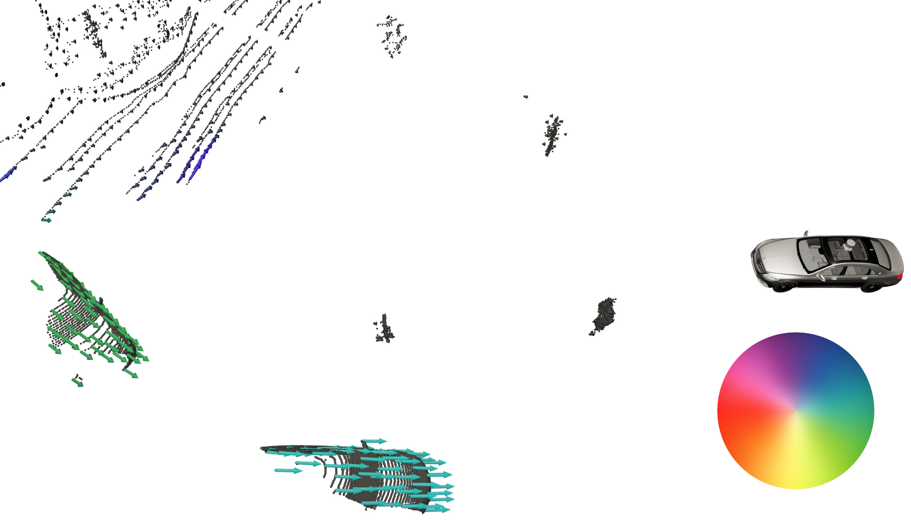

# Code for Paper: Self-Supervised LiDAR Scene Flow and Motion Segmentation
Stefan Baur<sup>\*</sup>, David Emmerichs<sup>\*</sup>, Frank Moosmann, Peter Pinggera, Björn Ommer and Andreas Geiger (<sup>\*</sup>: equal conribution)

[[Paper]](https://openaccess.thecvf.com/content/ICCV2021/papers/Baur_SLIM_Self-Supervised_LiDAR_Scene_Flow_and_Motion_Segmentation_ICCV_2021_paper.pdf) [[Supplementary Material]](https://openaccess.thecvf.com/content/ICCV2021/supplemental/Baur_SLIM_Self-Supervised_LiDAR_ICCV_2021_supplemental.zip) [[Project Page]](https://baurst.github.io/slim/)



## Presentation Video
[](https://youtu.be/z34H43BOEVw)

## Installation

This repository has been developed and tested for
* Ubuntu 18.04
* CUDA 10.2
* CUDNN 7.6.5

First of all, clone the repository:

```bash
git clone --recursive
```
Download the datasets [Kitti Raw](http://www.cvlibs.net/datasets/kitti/raw_data.php), [nuscenes](https://www.nuscenes.org/), [Kitti Scene Flow](http://www.cvlibs.net/datasets/kitti/eval_scene_flow.php).
Then, create folder with symlinks to your datasets (referred to as `INPUT_DATADIR` in the following) that you would like to use.

```bash
mkdir -p /path/to/my_datasets
cd /path/to/my_datasets
ln -s /path/to/nuscenes/dataset nuscenes
ln -s /path/to/kitti_raw kitti_raw
ln -s /path/to/kitti_scene_flow_data kitti_sf_data
```

Also, create a destination folder for the training logs (`OUTPUT_DATADIR`):
```bash
mkdir -p /path/to/output_destination
```

Change into the base directory of the repo and set `INPUT_DATADIR` (path to your datasets with the symlinks) and `OUTPUT_DATADIR` (path to logs) in [scripts/set_env_variables.bash](scripts/set_env_variables.bash):

```bash
cd path/to/this/repo
vim scripts/set_env_variables.bash
```

Create the virtual environment, build tensorflow custom ops and set the necessary env variables: `SRC_DIR`, `CFG_DIR`, `INPUT_DATADIR`, `OUTPUT_DATADIR`.

```bash
# in root folder of this repository execute
python3 -m venv .venv --prompt usfl
source .venv/bin/activate
pip3 install -U setuptools pip
pip3 install -r requirements.txt


bash scripts/build_all.bash # builds TF custom ops
source scripts/set_env_variables.bash # sets environment variables
```

Also, you need to install the [nuscenes-devkit](https://github.com/nutonomy/nuscenes-devkit).

## Running experiments
The entry point for trainings is unsup_flow/cli.py.
We use a unsup_flow/config/config.yml with incremental configurations to configure the experiments. The default configuration is loaded for every experiment.

```bash
# default experiment
python unsup_flow/cli.py --prod
```

Incremental config changes can be applied using the `-c` flag. For example, to run a training using the RAFT flow backbone on nuscenes without using the confidence weights for static aggregation:
```bash
python unsup_flow/cli.py --prod -c nuscenes sota_us sota_net no_stataggr_weight
```
This will, starting from the default config, recursively apply the changes to the config that are specified in the config file under sections nuscenes, sota_us, sota_net, no_stataggr_weight in that order.

Individual changes to the config can also be made using the `-kv` flag, for example to change the initial learning rate from 0.0001 (default) to 0.005:
```bash
python unsup_flow/cli.py --prod -c nuscenes -kv learning_rate initial 0.005
```

> :exclamation: NOTE: `-kv` takes a list of strings (e.g. `learning_rate initial`) and then a value (e.g. `0.005`). The list of strings specify the config value location in the hierarchy of dictionaries!

## Using your own dataset
Go to [usfl_io/io_tools.py:1009](usfl_io/io_tools.py#L1009) and implement a function that returns a TF Dataset, returning the following dict:

```python
dict:
    name []
    pcl_t0 [N0, 3]
    ref_t0 [N0] (opt.)
    semantics_t0 [N0] (opt.)
    pcl_t1 [N1, 3]
    ref_t1 [N1] (opt.)
    semantics_t1 [N1] (opt.)
    odom_t0_t1 [4, 4] (opt.)
    flow_gt_t0_t1 dict (opt.):
        flow [N0, 3]
        annotation_mask [N0]
        nn_interpolated_mask [N0]
        exact_gt_mask [N0]
        ego_flow_mask [N0] (opt.)
    flow_gt_t1_t0 dict (opt.):
        flow [N1, 3]
        annotation_mask [N1]
        nn_interpolated_mask [N1]
        exact_gt_mask [N1]
        ego_flow_mask [N1] (opt.)
```

You can use one of the existing datasets for inspiration. Most of the above data is optional (opt.) and will be used to generate informative metrics.

Coordinate system: Positive z-Axis is opposite to the direction of gravity, x is forward, y to the left. (Right handed coordinate system.)
The origin should be around 1.7m above ground and in the center of the recording sensor.


## Cite

 ```latex
 @InProceedings{Baur_2021_ICCV,
    author    = {Baur, Stefan Andreas and Emmerichs, David Josef and Moosmann, Frank and Pinggera, Peter and Ommer, Bj\"orn and Geiger, Andreas},
    title     = {SLIM: Self-Supervised LiDAR Scene Flow and Motion Segmentation},
    booktitle = {Proceedings of the IEEE/CVF International Conference on Computer Vision (ICCV)},
    month     = {October},
    year      = {2021},
    pages     = {13126-13136}
}
 ```

## Legal Information
Source code has been tested solely for our own use cases, which might differ from yours.
Notice: Before you use the program in productive use, please take all necessary precautions, e.g. testing and verifying the program with regard to your specific use.

[Code of Conduct](CODE_OF_CONDUCT.md)
[Contribution Guidelines](CONTRIBUTING.md)
